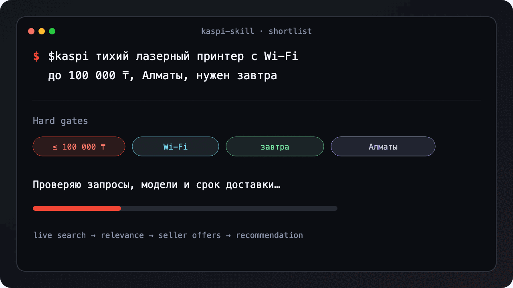

# Kaspi Skill

> 🛒 Live Kaspi search with seller-verified delivery and official app QR codes. Python 3.10+. Stdlib-first.

[](LICENSE)
[](https://www.python.org/)
[](https://github.com/sw1pp3r/kaspi-skill/actions/workflows/test.yml)
[](CONTRIBUTING.md)
[](https://github.com/sw1pp3r/kaspi-skill/stargazers)

**Kaspi Skill is an Agent Skill and Python CLI that searches live Kaspi listings, ranks exact product matches, verifies seller-level price and delivery dates, compares specifications, and captures Kaspi's official app QR codes for shoppers in Kazakhstan. It uses standard-library APIs, stores no exact address, and limits each run to polite, bounded requests.**

Kaspi search cards are useful for discovery, but the cheapest card is not always the right SKU, seller, or delivery promise. This skill turns a shopping request into a short, decision-ready comparison with explicit evidence and a single recommendation.

<p align="center">
  
</p>

> [!IMPORTANT]
> This is an unofficial community project. It is not affiliated with, endorsed by, or operated by Kaspi.kz. Kaspi endpoints are undocumented and may change; use the tool responsibly and follow the marketplace's terms and applicable law.

## Quick start

Install the skill for Codex:

```bash
npx skills add sw1pp3r/kaspi-skill -g -a codex -y
```

Then ask:

```text
Use $kaspi to find a quiet laser printer with Wi-Fi under 100,000 ₸ in Almaty that can arrive tomorrow.
```

The repository also exposes a standalone CLI:

```bash
git clone https://github.com/sw1pp3r/kaspi-skill.git
cd kaspi-skill
python3 scripts/kaspi.py --help
```

## Why this exists

A decision-ready marketplace answer needs more than a product-card scrape. It must reject keyword spam, keep distinct models separate, verify the final seller offer, translate relative delivery labels into absolute local dates, surface specification conflicts, and avoid presenting city-level availability as an address-level guarantee.

## How it works

1. Runs up to six bounded queries against Kaspi's live product search.
2. Scores title, brand, model, category, required terms, material, and exclusions.
3. Deduplicates repeated listings while preserving meaningful seller or model variants.
4. Opens finalists and checks the seller-offers response for current price, seller, cost, and absolute delivery date.
5. Extracts product-page specifications and surfaces contradictions instead of silently picking one value.
6. Captures Kaspi's official app QR modal through [agent-browser](https://github.com/vercel-labs/agent-browser), or keeps a clickable link when visual capture is unavailable.
7. Returns a compact Markdown table, later alternatives, one recommendation, delivery evidence, warnings, and the local checked timestamp.

The CLI is implemented with the [Python standard library](https://docs.python.org/3/library/) and follows the portable [Agent Skills specification](https://agentskills.io/specification). It accesses public Kaspi shopping pages and endpoints; it does not log in, place orders, or store an exact address.

## Install

### Agent skill

```bash
npx skills add sw1pp3r/kaspi-skill -g -a codex -y
```

To inspect the package before installing:

```bash
npx skills add sw1pp3r/kaspi-skill --list
```

### Manual

```bash
git clone https://github.com/sw1pp3r/kaspi-skill.git ~/.codex/skills/kaspi
python3 ~/.codex/skills/kaspi/scripts/kaspi.py --help
```

Python 3.10 or newer is required. The core code uses standard-library APIs. Windows does not ship an IANA timezone database, so install the data package once with `python -m pip install tzdata`; macOS and mainstream Linux distributions normally provide it through the operating system. Official QR capture additionally requires [agent-browser](https://github.com/vercel-labs/agent-browser); use `--qr-mode none` when it is not installed.

## CLI usage

Save city-level defaults without an address:

```bash
python3 scripts/kaspi.py location set \
  --city-code 750000000 \
  --city-name "Алматы" \
  --zone Magnum_ZONE1 \
  --timezone Asia/Almaty
```

Build a seller-verified shortlist:

```bash
python3 scripts/kaspi.py shortlist \
  --query "лопатка кухонная деревянная" \
  --query "IKEA UTFORMA лопатка бук" \
  --require-term "лопатка|шпатель" \
  --require-material "дерево|бук|бамбук" \
  --exclude-term "силикон|пластик" \
  --delivery-window fast \
  --top 4 \
  --format markdown
```

Inspect known product pages:

```bash
python3 scripts/kaspi.py details \
  --url "https://kaspi.kz/shop/p/example-123/?c=750000000" \
  --qr-mode none
```

Delivery windows are strict: `today`, `tomorrow`, `fast` for today-or-tomorrow, and `any` for any seller-verified date. Missed-deadline options are separated rather than silently mixed into the main shortlist.

## Common shopping scenarios

1. **Arrive today** — keep only same-day or express seller offers in the main shortlist.
2. **Exactly tomorrow** — exclude same-day and later listings when the date itself is the requirement.
3. **Hard material constraint** — reject title spam that mentions the requested material without matching the product.
4. **Exact model comparison** — group duplicate listings while keeping real SKU or model differences visible.
5. **Seller-level verification** — replace stale search-card price and delivery enums with the selected seller's current offer.
6. **Specification conflict detection** — report when description and characteristics disagree on length, material, or another decisive field.
7. **Official app handoff** — return a local image captured from Kaspi's own QR modal without embedding an address, session, or token.

## Privacy and request boundaries

- The saved profile contains only `cityCode`, `cityName`, `zone`, and `timezone` at `~/.config/kaspi-skill/location.json`.
- Exact addresses, account cookies, authentication tokens, and checkout data are not stored.
- Product URLs are normalized to public `kaspi.kz` links and tracking parameters are removed.
- Search is capped at six query variants and twenty results per query; product details are capped at six pages per run.
- The tool does not place an order. A QR code or link only opens the public product page or Kaspi app.
- `--qr-mode fallback` uses a third-party QR renderer and is diagnostics-only; the default official mode uses Kaspi's own modal.

See [docs/architecture.md](docs/architecture.md) for the data flow and trust boundaries, and [SECURITY.md](SECURITY.md) for vulnerability reporting.

## FAQ

**How do I search Kaspi products with an AI agent?**

Install the repository with `npx skills add sw1pp3r/kaspi-skill -g -a codex -y`, then invoke `$kaspi` with the product, budget, hard constraints, city, and deadline. The skill runs several query variants, verifies finalists at seller level, and returns three to six comparable rows instead of a long unranked search dump.

**Where does Kaspi Skill store my location?**

The optional profile is a small JSON file at `~/.config/kaspi-skill/location.json`, unless `KASPI_LOCATION_CONFIG` overrides the path. It stores a city code, city name, delivery zone, and timezone only. It never stores a street, apartment, checkout address, Kaspi account cookie, token, or browser session.

**Why can the delivery date differ from the Kaspi search card?**

Search-card delivery is preliminary and can contain a stale relative enum such as `TOMORROW`. For finalists, Kaspi Skill reads the selected seller's absolute delivery timestamp and converts it to the configured local timezone. That seller date wins, but the exact address and delivery slot still must be confirmed during checkout.

**Can I use Kaspi Skill without agent-browser?**

Yes. Live search, ranking, product details, seller offers, and JSON or text output use only Python's standard library. Official QR capture needs `agent-browser` because the QR is rendered in Kaspi's product modal. Pass `--qr-mode none` to keep product links without QR images, or use fallback mode only for diagnostics.

**What is the difference between Kaspi Skill and a generic scraper?**

A generic scraper usually returns page data. Kaspi Skill applies a shopping decision contract: hard delivery gates, relevance scoring, model-aware deduplication, seller-offer verification, specification conflict detection, a short comparison, and one recommendation. It also keeps city-level evidence separate from the address-level promise that only checkout can confirm.

## Development

```bash
python3 -m unittest discover -s tests -v
python3 -m py_compile scripts/kaspi.py
python3 scripts/kaspi.py --help
```

The test suite uses local fixtures and mocks for network and browser boundaries; it does not send marketplace requests.

## Contributing

See [CONTRIBUTING.md](CONTRIBUTING.md). Bug reports and pull requests are welcome. Look for [`good first issue`](https://github.com/sw1pp3r/kaspi-skill/labels/good%20first%20issue) tasks with concrete pointers and acceptance criteria.

## Star history

[](https://star-history.com/#sw1pp3r/kaspi-skill&Date)

## License

MIT. See [LICENSE](LICENSE).

---

<sub><strong>Keywords:</strong> kaspi, kaspi.kz, agent skill, codex skill, python cli, kazakhstan shopping, live product search, seller verification, delivery date, price comparison, marketplace research, product shortlist, official qr code, shopping assistant, ecommerce, russian language, almaty delivery, model deduplication, specification comparison, agent-browser.</sub>
