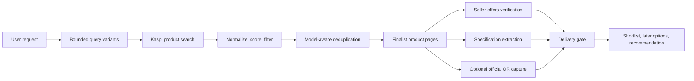

# Architecture

Kaspi Skill has two layers:

1. `SKILL.md` defines the agent workflow, evidence hierarchy, response shape, and safety boundaries.
2. `scripts/kaspi.py` implements a dependency-free CLI that produces structured JSON, text, or decision-ready Markdown.

## Data flow

## Evidence hierarchy

For price and delivery, seller-offer data wins over a search card. An absolute seller delivery timestamp wins over a relative enum such as `TOMORROW`. Product-page characteristics and descriptions are retained separately so contradictions can be surfaced. Checkout remains the final authority for an exact address and slot.

## Trust boundaries

- Only `kaspi.kz` and its subdomains are accepted as product URLs.
- Public product URLs are stripped to a city code and no fragment.
- Core Python code sends requests to Kaspi only. Diagnostics-only fallback QR mode also contacts `quickchart.io`.
- `agent-browser` runs as a separate process and receives a city cookie plus a public product URL; it does not receive an account session from this tool.
- Marketplace HTML, JSON, and seller fields are treated as untrusted input and normalized before output.

## Request budgets

- At most six search query variants per run.
- At most twenty search results per query.
- At most six product-detail pages per run.
- Default delay of 0.8 seconds between sequential requests.
- Default network and browser timeout of 25 seconds.

These limits are product constraints, not anti-blocking tricks. If an upstream endpoint changes, the correct response is to inspect and update the implementation, not to evade marketplace controls.

## Local state

`location set` writes `~/.config/kaspi-skill/location.json` unless `KASPI_LOCATION_CONFIG` overrides the path. The allowed keys are `cityCode`, `cityName`, `zone`, and `timezone`. Exact addresses, cookies, tokens, cart state, and order data are outside the model.
